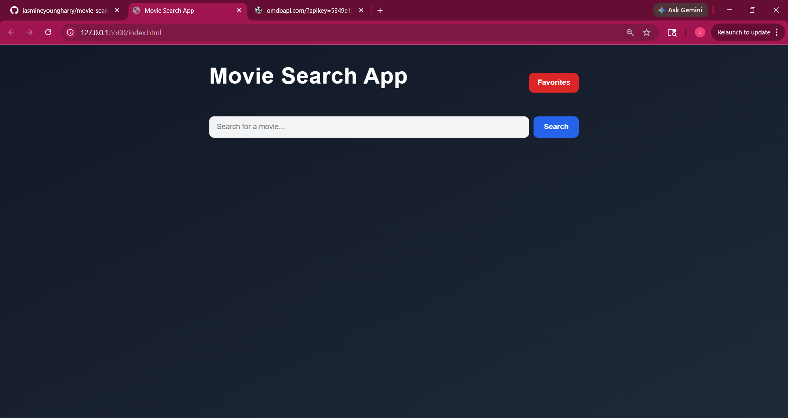
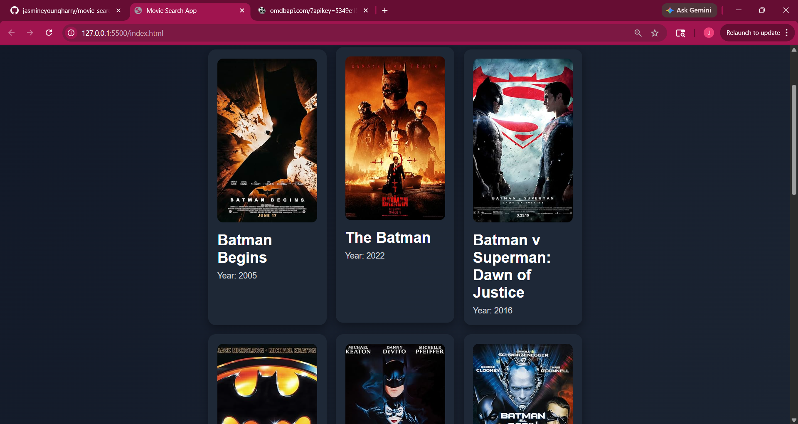
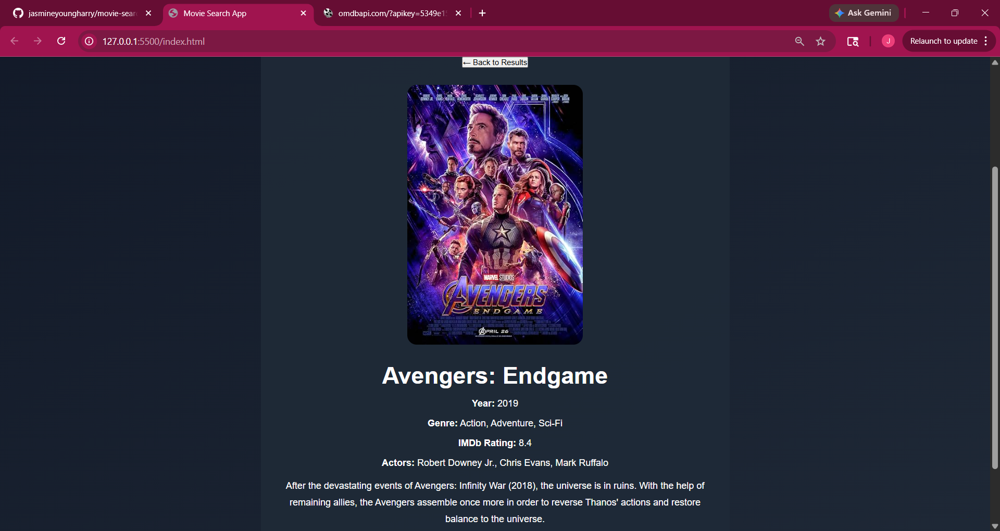
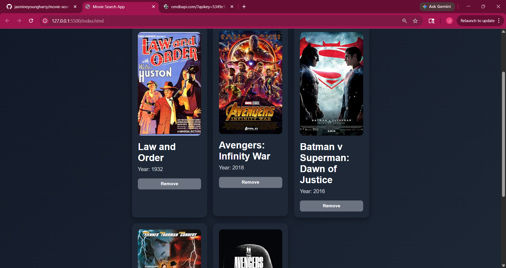

# Movie Search App

A modern and responsive Movie Search App built with HTML, CSS, and JavaScript using the OMDb API.

Users can search for movies, browse multiple results, view detailed movie information, and save favorite movies using localStorage.

---

## Features

- Search movies by title
- Display multiple movie search results
- View detailed movie information
- Responsive design for desktop and mobile
- Loading spinner while fetching data
- Press Enter to search
- Add movies to favorites
- Remove movies from favorites
- Persistent favorites using localStorage
- Error handling for invalid searches
- Smooth UI animations and hover effects

---

## Technologies Used

- HTML5
- CSS3
- JavaScript (Vanilla JS)
- OMDb API

---

## Screenshots

### Home Page




---

### Movie Details



---

### Favorites View



---

## API Used

OMDb API

https://www.omdbapi.com/

---

## What I Learned

Through this project I improved my understanding of:

- Working with APIs
- Using fetch() and async/await
- DOM manipulation
- Event listeners
- Dynamic rendering
- Responsive web design
- localStorage
- Error handling
- JavaScript array methods

---

## Future Improvements

Potential future upgrades:

- Dark/light mode
- Search history
- Movie trailers
- Genre filtering
- Pagination
- Better animations

---

## How to Run the Project

1. Clone the repository

```bash
git clone https://github.com/YOUR_USERNAME/movie-search-app.git